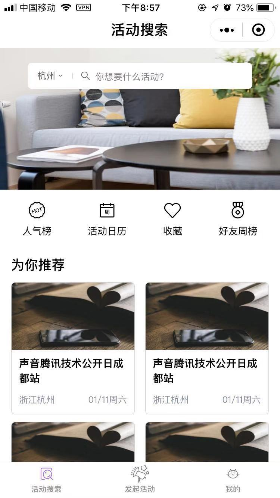
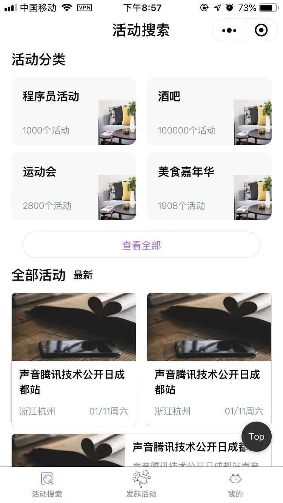
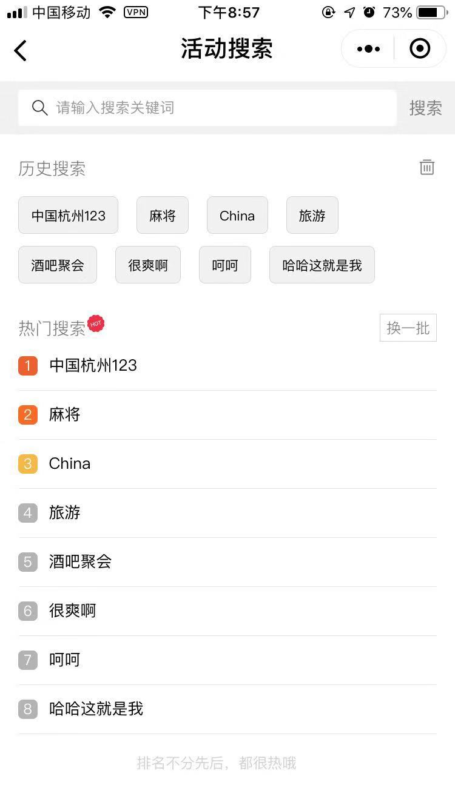
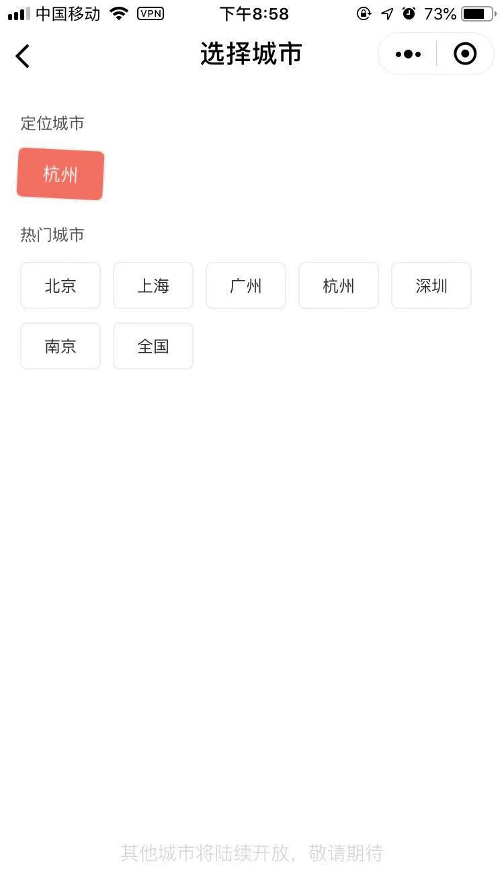
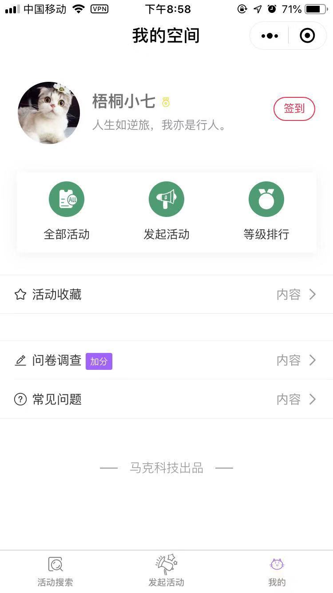
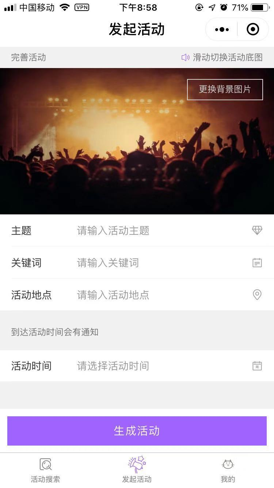
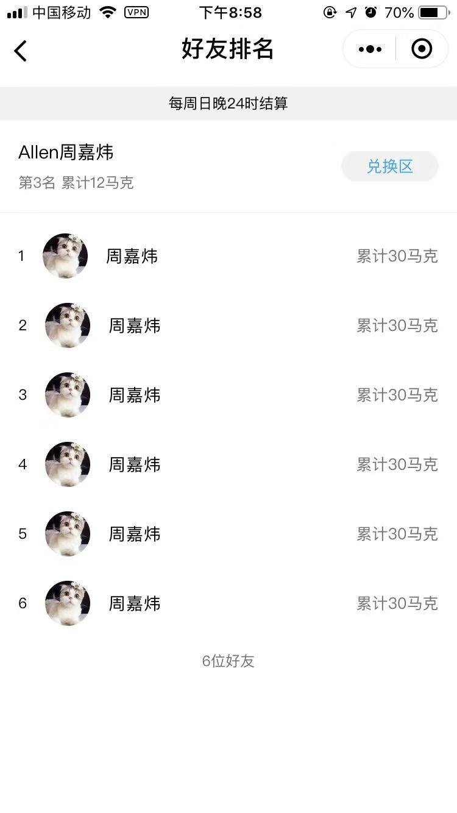
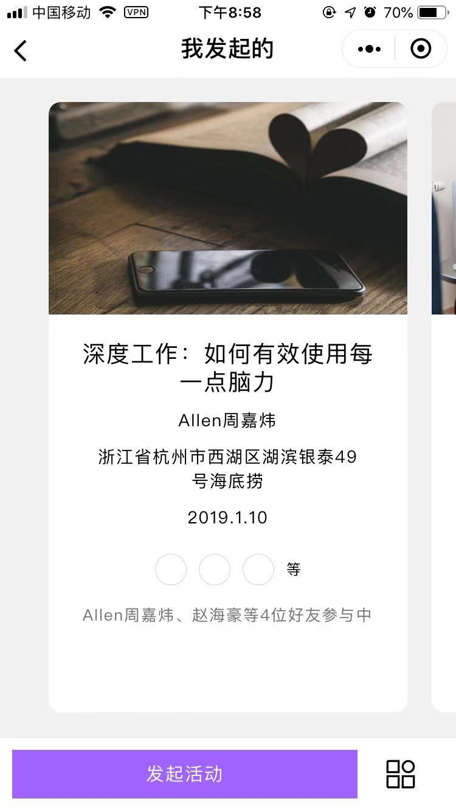

# 「马克」 Mark 🎉🎈

    「马克」Mark 小程序，活动的集散地，拉上你的微信好友一起去吧。

## 展示

    
    

    
    

    
    

    
    

    

## 功能规划

 ### 1、「一期」主要功能：
 --------------
  - 活动集散地，丰富的活动内容 ✅

  - 你可以发起活动，邀请好友参加 ✅

  - 只属于你们的个性邀请涵

  - 活动快到提醒

  - 用户自发发起活动 ✅

### 2、「计划」功能：
----------------
 - 丰富的邀请函模板

 - 活动联想功能，个性化智能推荐

### 3、系统配置
 ----------------

 - 前台小程序 - 原生小程序 or mpvue + UI（待定）- 部署腾讯云

   - 活动展示、分享、组织
   - 用户基础信息展示、美化

- 中后台管理系统 & 微信自带数据中心 - vue + ElementUI （已创建 https://allenchinese.github.io/MarkMiniapp-Data-System/dist/#/ ）

  - 用户数据管理
  - 活动爬取管理
  - 日活、月活等数据监控
  - 小程序错误信息监控
  - 用户反馈信息管理
  - 系统账户管理

--------------------------
    初始一个超管账号，可在管理系统新增账户

### 4、小程序原型
---------------------------

    https://free.modao.cc/workspace/apps/p00887282491539065900782/preview

### 5、中后台数据中心
----------------------------
    https://allenchinese.github.io/icevue/dist/
